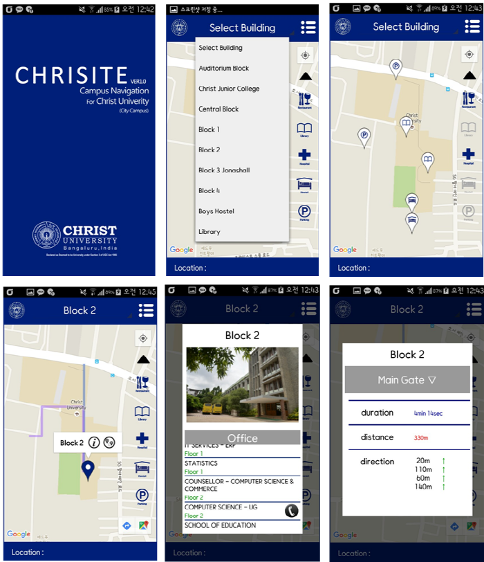

# CampusNavigation

This app is the test app. So we did NOT upload in the android app store.

## 1. Why did we kick-off this project?
When we arrived at India, we was surprised by campus size in India.
Because of campus size, It was so difficult to find each building. So we have developed this Map Application targeting the new comers of Christ University and also the students already studying in the college. **The purpose of this application is helping new comer to find building easily and offer information about campus**.

## 2. Feature
This application provides three main services. 
+ Checks user’s current location. 
+ Shows location of building where user wants to go and distance and duration to destination building. Also it shows route by color line. 
+ Info each building`s information about office and class such as classroom name, office phone number and so on.

## 3. Enviroment
+ Minimum Android: 
+ DB: 

## 4. Screenshot

## 5. Copyright
(C) 2015. Kotra-Iolite India intern 3 batch & Christ University all rights reserved.
